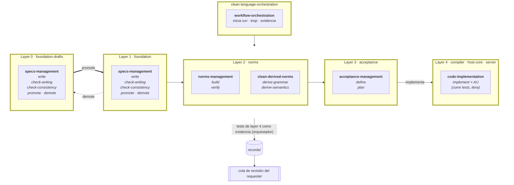

# Repos de Clean: ejemplo en Mermaid

Caja gruesa: repo. Caja fina: módulo instalado en él, con sus casos de uso.
En todos los repos se instalan además `development-methodology` y `utilities`.

```mermaid
flowchart TB
    subgraph ORCH["clean-language-orchestration"]
        WO["<b>workflow-orchestration</b><br/><i>inicia run · loop · evidencia</i>"]
    end

    subgraph LAYERS[" "]
        direction LR
        subgraph L0["Layer 0 · foundation-drafts"]
            SM0["<b>specs-management</b><br/><i>write<br/>check-writing<br/>check-consistency<br/>promote · demote</i>"]
        end
        subgraph L1["Layer 1 · foundation"]
            SM1["<b>specs-management</b><br/><i>write<br/>check-writing<br/>check-consistency<br/>promote · demote</i>"]
        end
        subgraph L2["Layer 2 · norms"]
            NM["<b>norms-management</b><br/><i>build<br/>verify</i>"]
            CDN["<b>clean-derived-norms</b><br/><i>derive-grammar<br/>derive-semantics</i>"]
        end
        subgraph L3["Layer 3 · acceptance"]
            AM["<b>acceptance-management</b><br/><i>define<br/>plan</i>"]
        end
        subgraph L4["Layer 4 · compiler · host-core · server"]
            CI["<b>code-implementation</b><br/><i>implement × AU<br/>(corre tests, itera)</i>"]
        end

        L0 == promote ==> L1
        L1 -. demote .-> L0
        L1 --> L2 --> L3 -- implementa --> L4
    end

    REC[("records/")]
    QUEUE[["cola de revisión del requester"]]

    ORCH --> LAYERS
    LAYERS -- "tests de layer 4 como evidencia (orquestador)" --> REC
    REC --> QUEUE

    classDef repo stroke-width:4px
    classDef module stroke-width:1px
    class ORCH,L0,L1,L2,L3,L4 repo
    class WO,SM0,SM1,NM,CDN,AM,CI module
    style LAYERS stroke-width:0px,fill:none
```
